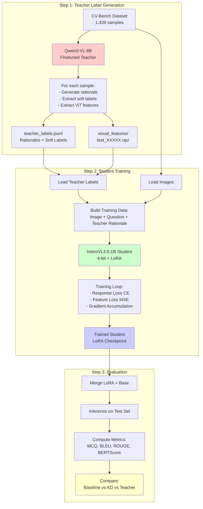
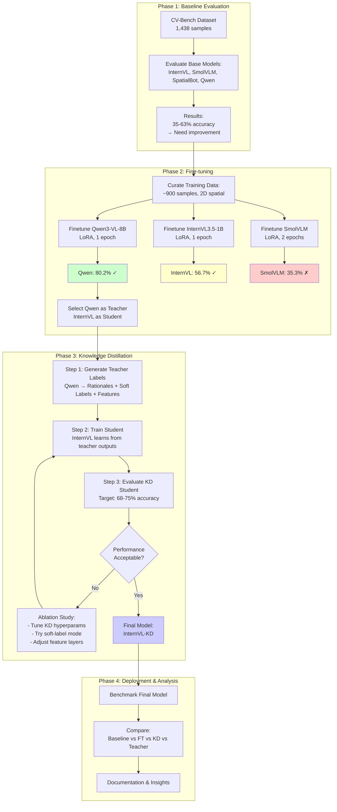
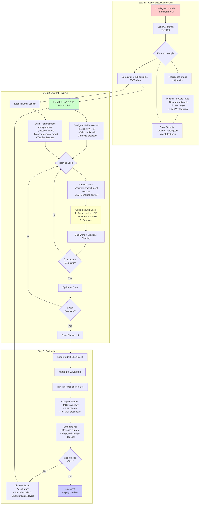
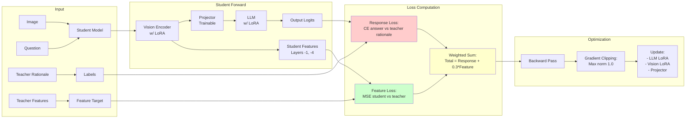

# Vision-Language Models: Spatial Reasoning Enhancement

**A comprehensive study on improving spatial understanding in small Vision-Language Models through fine-tuning and knowledge distillation**

---

## 📑 Table of Contents

1. [Project Overview](#-project-overview)
2. [Model Architectures](#-model-architectures)
3. [Evaluation Metrics](#-evaluation-metrics)
4. [Fine-tuning Methodology](#-fine-tuning-methodology)
5. [Knowledge Distillation](#-knowledge-distillation)
6. [Experimental Results](#-experimental-results)
7. [Pipeline Workflows](#-pipeline-workflows)
8. [Repository Structure](#-repository-structure)
9. [Usage](#-usage)

---

## 🎯 Project Overview

This project aims to enhance spatial reasoning capabilities in small Vision-Language Models (VLMs) through a systematic approach involving:

- **Baseline Evaluation**: Testing multiple VLMs on 2D spatial reasoning tasks
- **Fine-tuning**: Domain-specific adaptation using LoRA (Low-Rank Adaptation)
- **Knowledge Distillation**: Transferring knowledge from larger finetuned models to smaller, efficient models
- **Comprehensive Evaluation**: Multi-metric assessment across spatial reasoning tasks

### Key Objectives

1. **Improve spatial understanding** in tasks like:
   - Object counting
   - Spatial relationships (left/right, above/below, proximity)
   - Distance estimation
   
2. **Maintain efficiency** by focusing on small models (~1-3B parameters)

3. **Enable practical deployment** through knowledge distillation to compact models

### Dataset

**CV-Bench 2D Spatial Reasoning Subset** ([nyu-visionx/CV-Bench](https://huggingface.co/datasets/nyu-visionx/CV-Bench))
- **Tasks**: Count, Relation
- **Format**: Multiple-choice questions (MCQ) with images
- **Evaluation Size**: 1,438 samples (full baseline) / 1,048 samples (finetuned)
- **Training Size**: ~900 samples (finetuning)

---

## 🏗️ Model Architectures

### Overview of Evaluated Models

| Model | Parameters | Vision Encoder | Language Model | Spatial Specialty |
|-------|-----------|----------------|----------------|-------------------|
| **InternVL3.5-1B** | ~1B | InternViT-300M-448px | Qwen2.5-1B | General VLM |
| **SmolVLM-Instruct** | ~500M | SigLIP-400M-384px | SmolLM2-135M | General VLM |
| **SpatialBot-3B** | ~3B | CLIP-ViT-L-336px | Custom-3B | Spatial-specialized |
| **Qwen3-VL-8B** | ~8B | ViT-600M-448px | Qwen2.5-7B | General VLM (Teacher) |

---

### 1. InternVL3.5-1B (Primary Student Model)

#### Architecture Components

**Vision Encoder: InternViT-300M-448px**
- Based on Vision Transformer (ViT) architecture
- Input resolution: 448×448 pixels
- **Dynamic resolution support**: Images split into tiles based on aspect ratio
- Patch size: 14×14
- Number of visual tokens per tile: 256 (calculated as `(448/14)^2 * 0.5^2`)
- Output: Visual embeddings per tile

**Vision-Language Connector (Projector)**
- MLP-based projection layer (`mlp1`)
- Maps vision encoder outputs (InternViT embedding space) to language model embedding space
- Learnable projection allows vision-language alignment

**Language Model: Qwen2.5-1B**
- Decoder-only transformer
- Vocabulary size: ~150K tokens
- Specialized tokens: ``, `</img>`, `<IMG_CONTEXT>` for image regions
- Chat template format: `<|im_start|>...<|im_end|>`

#### How to Work with InternVL

**Loading the Model:**
```python
from transformers import AutoModel, AutoTokenizer

model = AutoModel.from_pretrained(
    "OpenGVLab/InternVL3_5-1B-Instruct",
    torch_dtype=torch.bfloat16,
    trust_remote_code=True,
    device_map="auto"
)
tokenizer = AutoTokenizer.from_pretrained(
    "OpenGVLab/InternVL3_5-1B-Instruct",
    trust_remote_code=True
)
```

**Image Preprocessing:**
- Uses dynamic tiling (splits images based on aspect ratio)
- Each tile is resized to 448×448
- Number of tiles depends on image aspect ratio (1-12 tiles)
- Special tokens sequence: `<IMG_CONTEXT>*256</img>` per tile

**Training Components:**
1. **Vision Encoder**: Can be frozen or trained with LoRA
2. **Projector**: Can be frozen or unfrozen for training
3. **Language Model**: Trained with LoRA adapters on:
   - `q_proj`, `k_proj`, `v_proj`, `o_proj` (attention)
   - `gate_proj`, `up_proj`, `down_proj` (MLP)

---

### 2. Qwen3-VL-8B (Teacher Model)

#### Architecture Components

**Vision Encoder: ViT-600M-448px**
- Vision Transformer with 600M parameters
- Input resolution: 448×448 pixels
- Patch-based encoding with positional embeddings
- Outputs rich visual features for spatial understanding

**Vision-Language Connector**
- Cross-attention based adapter
- Enables fine-grained vision-language alignment
- Learnable query tokens attend to visual features

**Language Model: Qwen2.5-7B**
- Large decoder-only transformer (7B parameters)
- Strong reasoning and instruction-following capabilities
- Vocabulary: ~150K tokens

#### How to Work with Qwen3-VL

**Loading with Unsloth (Efficient 4-bit):**
```python
from unsloth import FastVisionModel

model, tokenizer = FastVisionModel.from_pretrained(
    "unsloth/Qwen3-VL-8B-Instruct-unsloth-bnb-4bit",
    load_in_4bit=True,
    use_gradient_checkpointing="unsloth"
)
```

**Training Configuration:**
- **Quantization**: 4-bit (BitsAndBytes NF4) for memory efficiency
- **LoRA targets**: 
  - Vision layers: Can target vision encoder layers
  - Language layers: All linear projections in LLM
- **Memory optimization**: Gradient checkpointing enabled

**Image Processing:**
- Expects RGB images
- Chat-based conversation format
- Supports multi-turn dialogues with images

---

### 3. SmolVLM-Instruct (500M Baseline)

#### Architecture Components

**Vision Encoder: SigLIP-400M-384px**
- SigLIP (Sigmoid Loss for Language-Image Pre-training)
- Resolution: 384×384 pixels (can be configured to 512×512)
- Efficient image-text alignment

**Language Model: SmolLM2-135M**
- Compact language model (135M parameters)
- Optimized for efficiency
- Limited spatial reasoning in base form

#### How to Work with SmolVLM

**Loading:**
```python
from transformers import AutoProcessor, AutoModelForImageTextToText

processor = AutoProcessor.from_pretrained("HuggingFaceTB/SmolVLM-Instruct")
model = AutoModelForImageTextToText.from_pretrained(
    "HuggingFaceTB/SmolVLM-Instruct",
    torch_dtype=torch.float16,
    device_map="auto"
)
```

**Training Considerations:**
- Smaller capacity requires careful fine-tuning
- Prone to overfitting on small datasets
- Benefits from lower learning rates (1e-5 to 5e-5)
- Gradient checkpointing essential for training

---

### 4. SpatialBot-3B (Spatial-Specialized Baseline)

#### Architecture Components

**Vision Encoder: CLIP-ViT-L-336px**
- CLIP Vision Transformer Large
- Resolution: 336×336 pixels
- Pre-trained on spatial reasoning tasks

**Language Model: Custom 3B**
- Specialized for spatial understanding
- Strong baseline for spatial tasks

**Specialty**: Pre-trained specifically for spatial reasoning, making it a strong baseline.

---

## 📊 Evaluation Metrics

### Why These Metrics?

The evaluation uses a **multi-faceted approach** combining classification accuracy with text generation quality metrics:

#### 1. **MCQ Accuracy** (Primary Metric)
- **What**: Percentage of correctly predicted answer letters (A/B/C/D)
- **Why Chosen**: 
  - Direct measure of spatial reasoning capability
  - Eliminates ambiguity in free-form text generation
  - Allows precise comparison across models
- **Tangible Insights**:
  - ✅ Reveals model's actual understanding vs. verbosity
  - ✅ Fair comparison (not influenced by text length)
  - ✅ Task-specific breakdown (Count vs. Relation tasks)

#### 2. **BLEU Score** (Bigram, 0-1)
- **What**: Measures n-gram overlap between prediction and reference
- **Why Chosen**: 
  - Standard MT metric adapted for VLM evaluation
  - Captures precision of generated tokens
- **Tangible Insights**:
  - ⚠️ Low BLEU ≠ Wrong answer (model may use different wording)
  - ✅ High BLEU with high accuracy → Good explanation quality
  - ❌ Models outputting only "A" get 0 BLEU but can have high MCQ accuracy

**Observed**: Most models get very low BLEU (0.0-0.17) because they output terse answers ("A", "B") rather than full sentences. **Qwen3-VL-8B finetuned** achieves 0.17 BLEU because it generates rationales.

#### 3. **ROUGE Scores** (ROUGE-1, ROUGE-2, ROUGE-L)
- **What**: Recall-based metric measuring word overlap
- **Why Chosen**: 
  - Complements BLEU's precision focus
  - ROUGE-L captures longest common subsequence (better for paraphrasing)
- **Tangible Insights**:
  - ✅ Better suited for MCQ answers than BLEU
  - ✅ ROUGE-1 ≈ MCQ accuracy for single-letter answers
  - Models with higher ROUGE-L show better structured responses

**Observed Pattern**: ROUGE-1 closely tracks MCQ accuracy (0.34-0.63 range), confirming most models output brief answers.

#### 4. **METEOR** (0-1)
- **What**: Harmonic mean of precision/recall with synonym matching
- **Why Chosen**: 
  - Accounts for semantic similarity (synonyms, stems)
  - More lenient than BLEU for paraphrases
- **Tangible Insights**:
  - ✅ Rewards semantically correct but differently worded answers
  - Only **Qwen3-VL-8B (finetuned)** achieves significant METEOR (0.34) → It generates explanatory text

**Observed**: Most models score 0.0 METEOR because they only output "A"/"B"/"C"/"D" without additional context.

#### 5. **BERTScore** (Precision, Recall, F1)
- **What**: Semantic similarity using BERT embeddings
- **Why Chosen**: 
  - Captures meaning beyond surface-form overlap
  - Robust to paraphrasing and word reordering
- **Tangible Insights**:
  - ✅ Best metric for evaluating explanation quality
  - ✅ High BERTScore + High MCQ Accuracy → Model truly understands
  - **Qwen3-VL finetuned**: BERTScore F1 = 0.81 (best) → Rich, accurate explanations

**Observed Failure**: SmolVLM shows 0.0 BERTScore (likely due to empty/invalid outputs).

---

### Metrics Summary Table

| Metric | Range | Best For | Limitations |
|--------|-------|----------|-------------|
| **MCQ Accuracy** | 0-1 | Spatial reasoning correctness | Doesn't measure explanation quality |
| **BLEU** | 0-1 | Token-level precision | Penalizes valid paraphrases |
| **ROUGE-1/L** | 0-1 | Word/sequence recall | Surface-level matching |
| **METEOR** | 0-1 | Semantic similarity (stem/synonym) | Requires substantial text output |
| **BERTScore** | 0-1 | Deep semantic similarity | Computationally expensive |

---

### Key Insights from Metrics

#### ✅ What Works
1. **MCQ Accuracy + BERTScore**: Best combination for holistic evaluation
2. **Task-specific breakdown**: Reveals models are better at "Relation" (60-90%) than "Count" (23-70%)
3. **Teacher-Student gap**: Qwen 80.2% → InternVL 56.7% → Knowledge Distillation needed

#### ⚠️ Pitfalls Discovered
1. **BLEU/METEOR near-zero**: Most models output terse answers → Not indicative of failure
2. **High ROUGE ≠ Correctness**: Model could repeat question words
3. **BERTScore failure**: SmolVLM shows 0.0 → Likely generating empty/malformed outputs

---

## 🔧 Fine-tuning Methodology

### Overview

All models were fine-tuned using **LoRA (Low-Rank Adaptation)** to enable efficient training with limited computational resources. LoRA adds trainable low-rank matrices to frozen pre-trained weights, reducing trainable parameters by ~99%.

### Why Fine-tune?

1. **Domain Adaptation**: Pre-trained VLMs lack specialized spatial reasoning on CV-Bench tasks
2. **Task-Specific Learning**: MCQ format and spatial vocabulary require adaptation
3. **Efficiency**: LoRA enables training large models (8B params) on consumer GPUs
4. **Baseline Weakness**: Base models show 35-63% accuracy → Fine-tuning improves to 56-80%

---

### 1. InternVL3.5-1B Fine-tuning

**Notebook**: `finetuning_scripts/internvl_finetuning.ipynb`

#### Training Configuration

```yaml
Model: OpenGVLab/InternVL3_5-1B-Instruct
Dataset: abhi26/cvbench_2d_curated (900 samples)
Quantization: 4-bit (NF4) with bitsandbytes
LoRA Configuration:
  - Rank (r): 24
  - Alpha: 24
  - Dropout: 0
  - Target modules: [q_proj, k_proj, v_proj, o_proj, gate_proj, up_proj, down_proj]
  - Applied to: Language model only
Training:
  - Epochs: 1
  - Batch size: 2
  - Gradient accumulation: 8 (effective batch = 16)
  - Learning rate: 2e-4
  - Optimizer: AdamW
  - Scheduler: CosineAnnealingLR
  - Max length: 2048 tokens
  - Image tiles: Max 3 tiles (memory constraint)
```

#### Key Implementation Details

**Data Format:**
```json
{
  "id": 0,
  "image": "0.png",
  "conversations": [
    {"from": "human", "value": "<image>\n{prompt with options}"},
    {"from": "gpt", "value": "{answer letter}"}
  ]
}
```

**Special Handling:**
1. **Dynamic Image Tiling**: Images split into aspect-ratio-aware tiles
2. **Token Alignment**: Manual input_ids construction to ensure exact IMG_CONTEXT token count
3. **Label Masking**: Only assistant's response (answer) is supervised (prefix masked with -100)
4. **Vision Encoder**: Frozen (only LLM trained with LoRA)
5. **Projector**: Frozen initially, but can be unfrozen for better vision-language alignment

**Memory Optimization:**
- 4-bit quantization reduces memory from ~4GB to ~1GB
- Gradient checkpointing enabled
- `expandable_segments:True` for CUDA memory
- Intermediate tensors deleted after each batch

**Training Curve:**
- Loss decreases from ~2.5 to ~0.8 over 1 epoch
- Validation accuracy: ~57% (improved from ~35% baseline)
- Per-task: Count (56.8%), Relation (56.6%)

#### Results After Fine-tuning
- **Baseline**: 35% MCQ Accuracy
- **After Fine-tuning**: 56.7% MCQ Accuracy (+21.7% improvement)
- **Inference time**: 0.66s per sample (fast for deployment)

---

### 2. Qwen3-VL-8B Fine-tuning

**Notebook**: `finetuning_scripts/Qwen3_VL_(8B)_Vision_custom_spatialdata.ipynb`

#### Training Configuration

```yaml
Model: unsloth/Qwen3-VL-8B-Instruct-unsloth-bnb-4bit
Dataset: abhi26/sub_spatial_cleaned (500 samples)
Quantization: 4-bit (Unsloth optimized)
LoRA Configuration:
  - Rank (r): 16
  - Alpha: 16
  - Dropout: 0
  - Target modules: All linear layers (vision + language)
  - Vision encoder: Trainable
  - Language model: Trainable
Training:
  - Epochs: 1
  - Batch size: 2
  - Gradient accumulation: 4 (effective batch = 8)
  - Learning rate: 2e-4
  - Optimizer: adamw_8bit
  - Scheduler: Linear warmup
  - Max length: 2048 tokens
  - Warmup steps: 5
```

#### Key Implementation Details

**Unsloth Advantages:**
1. **Optimized 4-bit**: Faster than standard bitsandbytes
2. **Gradient checkpointing**: Built-in memory optimization
3. **FastVisionModel API**: Simplified training setup
4. **Both vision and language trainable**: Unlike InternVL approach

**Data Format (Conversational):**
```python
{
  "messages": [
    {
      "role": "user",
      "content": [
        {"type": "image", "image": <PIL.Image>},
        {"type": "text", "text": "{question with options}"}
      ]
    },
    {
      "role": "assistant",
      "content": [{"type": "text", "text": "{answer}"}]
    }
  ]
}
```

**Training Features:**
- `SFTTrainer` with `UnslothVisionDataCollator`
- Weights & Biases logging
- Memory tracking throughout training
- Push to HuggingFace Hub after training

**Training Results:**
- Training time: ~30 minutes for 1 epoch
- Memory usage: ~12GB VRAM (4-bit + gradient checkpointing)
- Final loss: ~0.5

#### Results After Fine-tuning
- **MCQ Accuracy**: 80.2% (best model)
- **Per-task**: Count (70.7%), Relation (91.7%) ← Excellent relation understanding
- **Inference time**: 1.92s per sample
- **BLEU**: 0.17 (generates explanations, not just letters)
- **BERTScore F1**: 0.81 (best semantic quality)

**Why Best Teacher Model:**
- Highest accuracy (80%)
- Generates rich rationales (useful for KD)
- Strong spatial reasoning (especially relations)

---

### 3. SmolVLM-Instruct Fine-tuning

**Notebook**: `finetuning_scripts/smolVLM_finetune_2.ipynb`

#### Training Configuration

```yaml
Model: HuggingFaceTB/SmolVLM-Instruct
Dataset: abhi26/cvbench_2d_curated (900 samples)
Quantization: None (float16)
LoRA Configuration:
  - Rank (r): 16
  - Alpha: 32 (alpha = 2*r for stronger adaptation)
  - Dropout: 0.1
  - Target modules: [q_proj, k_proj, v_proj, o_proj]
  - Applied to: Language model only
Training:
  - Epochs: 2
  - Batch size: 2
  - Gradient accumulation: 4 (effective batch = 8)
  - Learning rate: 5e-5 (lower for stability)
  - Optimizer: AdamW (fused=True)
  - Scheduler: Cosine with warmup (5 steps)
  - Max length: 2048 tokens
  - Image resolution: 384×384 (SigLIP default)
```

#### Key Implementation Details

**Challenges:**
1. **Small Capacity**: 500M params → Limited spatial reasoning ability
2. **Overfitting Risk**: High alpha (32) compensates but risks overfitting
3. **Slow Inference**: 7.5s per sample (slow vision encoder)

**Data Preprocessing:**
```python
def build_prompt(processor, prompt_text, answer=None):
    messages = [{
        'role': 'user',
        'content': [
            {'type': 'image'},
            {'type': 'text', 'text': prompt_text},
        ]
    }]
    if answer is not None:
        messages.append({
            'role': 'assistant',
            'content': [{'type': 'text', 'text': answer}]
        })
    return processor.apply_chat_template(messages, tokenize=False, 
                                          add_generation_prompt=(answer is None))
```

**Training Pipeline:**
1. **Prefetch Queue**: Background thread loads next batch while GPU trains
2. **Label Masking**: Prefix (question) masked; only answer supervised
3. **Mixed Precision**: FP16 autocast for memory efficiency
4. **Gradient Clipping**: Max norm 1.0 to prevent instability

**Training Observations:**
- Loss fluctuates (0.8-1.2) → Small model struggles with task complexity
- 2 epochs needed for convergence (vs. 1 for larger models)
- Validation accuracy plateaus at 35% → Model capacity bottleneck

#### Results After Fine-tuning
- **MCQ Accuracy**: 35.3% (no improvement from baseline)
- **Per-task**: Count (23%), Relation (50%)
- **Inference time**: 7.49s per sample (slowest)
- **BERTScore**: 0.0 (generating empty outputs)

**Analysis**: SmolVLM's small capacity limits spatial reasoning. Despite fine-tuning:
- Cannot distinguish spatial relationships well
- Counting tasks particularly weak (23% accuracy)
- Requires multi-task pre-training or larger capacity

---

### Fine-tuning Summary

| Model | Params | Epochs | Batch Size (Eff.) | LR | Baseline Acc. | Finetuned Acc. | Δ Improvement |
|-------|--------|--------|-------------------|----|--------------:|---------------:|--------------:|
| **Qwen3-VL-8B** | 8B | 1 | 8 | 2e-4 | ~45% | **80.2%** | +35.2% |
| **InternVL3.5-1B** | 1B | 1 | 16 | 2e-4 | ~35% | **56.7%** | +21.7% |
| **SmolVLM-500M** | 500M | 2 | 8 | 5e-5 | 35.3% | **35.3%** | +0% |

**Key Takeaways:**
1. ✅ **Larger models benefit more**: Qwen 8B shows massive improvement
2. ✅ **Medium models show moderate gains**: InternVL 1B improves significantly
3. ❌ **Small models hit capacity limits**: SmolVLM 500M cannot improve
4. ✅ **LoRA is efficient**: All models trained on single GPU with 4-bit quantization
5. ✅ **1 epoch sufficient**: Larger models converge quickly (except SmolVLM needs 2)

---

## 🧠 Knowledge Distillation

### What is Knowledge Distillation?

Knowledge Distillation (KD) transfers knowledge from a **large, accurate teacher model** to a **smaller, efficient student model**. The student learns to mimic the teacher's predictions and reasoning patterns.

**Goal**: Achieve teacher-level performance with student-level efficiency.

---

### Why Knowledge Distillation?

#### Problem
After fine-tuning:
- **Qwen3-VL-8B (Teacher)**: 80.2% accuracy, 1.92s inference, ~16GB VRAM
- **InternVL3.5-1B (Student)**: 56.7% accuracy, 0.66s inference, ~4GB VRAM

**Gap**: 23.5% accuracy difference

#### Solution
Use KD to transfer Qwen's spatial reasoning knowledge to InternVL, hoping to achieve:
- Target: 70-75% accuracy (teacher's 80% is upper bound)
- Maintain: Fast inference (<1s) and low memory (4GB)

---

### Knowledge Distillation Methods

This project implements **multi-level knowledge distillation** with three complementary approaches:

#### 1. **Response-Based Distillation** (Primary Method)

**How it works:**
- Teacher generates answers + rationales for training samples
- Student trained via standard supervised learning on teacher outputs
- Student learns to mimic teacher's response patterns

**Implementation:**
```python
# Teacher generates rich rationales
teacher_output = {
    "question": "Which object is closer?",
    "teacher_prediction": "A",
    "teacher_rationale": "The chair is closer because it occupies 
                          more of the foreground and appears larger 
                          due to perspective. Answer: A"
}

# Student trained to predict: rationale + answer
student_target = teacher_output["teacher_rationale"]
```

**Advantages:**
- ✅ Simple to implement (standard SFT)
- ✅ Student learns reasoning steps (not just labels)
- ✅ Works well for small students (no complex KL-divergence)

**Configuration:**
```python
kd_mode: "response"
use_rationale: True
alpha: 0.7  # Weight for KD loss vs. CE loss
temperature: 3.0  # Unused in response mode
```

---

#### 2. **Soft-Label Distillation** (Advanced)

**How it works:**
- Teacher outputs probability distribution over all answer options [A, B, C, D]
- Student trained to match teacher's distribution (not just argmax)
- Uses KL-divergence loss between teacher and student logits

**Theory:**
```
Teacher logits: [2.1, 0.3, -0.5, -1.2] → Softmax → [0.68, 0.11, 0.05, 0.03]
Student logits: [1.5, 0.8, -0.2, -0.9] → Softmax → [0.52, 0.26, 0.09, 0.05]

KL-Divergence Loss = Σ P_teacher * log(P_teacher / P_student)
```

**Why "soft" labels?**
- Hard label: [1, 0, 0, 0] (only correct answer)
- Soft label: [0.68, 0.11, 0.05, 0.03] (teacher's uncertainty)
- Soft labels contain **relational information** (e.g., "B is second-best option")

**Implementation:**
```python
# Temperature scaling softens distributions
def distillation_loss(student_logits, teacher_logits, temperature):
    soft_teacher = F.softmax(teacher_logits / temperature, dim=-1)
    soft_student = F.log_softmax(student_logits / temperature, dim=-1)
    kd_loss = F.kl_div(soft_student, soft_teacher, reduction='batchmean')
    return kd_loss * (temperature ** 2)  # Scale by T^2

# Combined loss
total_loss = alpha * kd_loss + (1 - alpha) * ce_loss
```

**Configuration:**
```python
kd_mode: "soft_label"
temperature: 3.0  # Higher = softer (more information in "wrong" classes)
alpha: 0.7  # 70% KD loss, 30% ground-truth CE loss
```

**Advantages:**
- ✅ Captures teacher's uncertainty and ranking
- ✅ Provides richer signal than hard labels
- ✅ Regularization effect (prevents overconfidence)

**Challenges:**
- ⚠️ Requires saving teacher logits (larger storage)
- ⚠️ Sensitive to temperature tuning
- ⚠️ Student must have similar architecture (same output space)

---

#### 3. **Feature-Based Distillation** (Multi-Level)

**How it works:**
- Extract intermediate hidden states from teacher's vision encoder
- Student's vision encoder trained to produce similar features
- MSE loss between teacher and student feature maps

**Why feature distillation?**
- Vision encoder learns **spatial representations** (edges, objects, layouts)
- Text generation quality depends on **input visual features**
- If student's vision features match teacher's, language model receives better input

**Architecture:**
```
Teacher (Qwen3-VL):
  ViT-600M → [Layer -4, Layer -1] → Extract features → Save to disk
  
Student (InternVL):
  InternViT-300M → [Layer -4, Layer -1] → Match teacher features
```

**Implementation:**
```python
# Teacher: Extract features during label generation
class VisualFeatureExtractor:
    def __init__(self, model, layer_indices=[-1, -4]):
        self.features = {}
        self._register_hooks(model, layer_indices)
    
    def forward_hook(self, name):
        def hook(module, input, output):
            self.features[name] = output.detach().cpu()
        return hook

# During training
teacher_feats = np.load(f"feat_{idx:05d}.npz")
teacher_feat_layer1 = torch.from_numpy(teacher_feats['layer_-1']).cuda()

# Student: Match features
student_feat_layer1 = student_vision_encoder.layers[-1].output

# Feature loss
feat_loss = F.mse_loss(
    project_to_dim(student_feat_layer1), 
    project_to_dim(teacher_feat_layer1)
)
```

**Multi-layer Matching:**
- **Layer -4** (middle): General object features
- **Layer -1** (last): High-level spatial relationships
- Both layers aligned → Student learns hierarchical spatial encoding

**Configuration:**
```python
feature_distillation: True
feature_loss_weight: 0.3
feature_layers: [-1, -4]
feature_projector_dim: 256  # Project both to 256-dim before MSE
```

**Total Loss:**
```python
total_loss = alpha * (response_loss OR kl_div_loss)
           + (1 - alpha) * ce_loss
           + feature_loss_weight * feat_mse_loss
```

**Advantages:**
- ✅ Improves vision understanding directly
- ✅ Complements response/soft-label distillation
- ✅ Helps even if language generation differs

**Challenges:**
- ⚠️ Requires feature extraction infrastructure
- ⚠️ Large storage (1 image = ~100MB features)
- ⚠️ Must align different vision architectures (ViT-600M vs. InternViT-300M)

---

### Knowledge Distillation Pipeline

The KD pipeline consists of **3 sequential steps**:

#### **Step 1: Generate Teacher Labels**

**Script**: `knowledge_distillation/generate_teacher_labels.py`

**Process:**
1. Load finetuned Qwen3-VL-8B (LoRA adapter: `abhi26/subCV_qwen3-8B_lora`)
2. Iterate through CV-Bench 2D test set
3. For each sample:
   - Generate rationale + answer (if `generate_rationale=True`)
   - Extract soft labels (probability distribution)
   - Extract visual features from ViT layers [-1, -4]
4. Save outputs:
   - `teacher_labels.jsonl`: Predictions, rationales, soft labels
   - `visual_features/feat_XXXXX.npz`: NumPy arrays of ViT hidden states

**Output Format (teacher_labels.jsonl):**
```json
{
  "idx": 0,
  "question": "How many chairs are visible?",
  "options": ["A. 2", "B. 3", "C. 4", "D. 5"],
  "ground_truth": "B",
  "teacher_prediction": "B",
  "teacher_rationale": "I can see three chairs in the image: one in the foreground-left, one in the middle-right, and one partially visible in the back. Answer: B",
  "teacher_soft_labels": [0.05, 0.82, 0.10, 0.03]
}
```

**Memory Requirement**: ~20GB disk space for 1,400 samples (features are large)

---

#### **Step 2: Train Student with KD**

**Script**: `knowledge_distillation/train_student_internvl.py`

**Configuration:**
```python
Student: OpenGVLab/InternVL3_5-1B-Instruct
Quantization: 4-bit NF4
LoRA (Language): r=16, alpha=16, target=[q/k/v/o_proj, gate/up/down_proj]
LoRA (Vision): r=8, alpha=8, target=[qkv, proj, fc1, fc2]
Projector: Unfrozen (trainable)

Training:
  - Epochs: 1-3
  - Batch size: 1 (gradient accumulation: 8)
  - Learning rate: 2e-4
  - Vision LR: 2e-5 (10x lower for stability)
  - Warmup: 10% of steps
  - Max length: 512 tokens (shorter for KD)
```

**Training Components:**

1. **Language Model LoRA**: Learn spatial reasoning language
2. **Vision Encoder LoRA**: Adapt visual feature extraction
3. **Projector Unfrozen**: Fine-tune vision→language alignment
4. **Response Loss**: Predict teacher rationale
5. **Feature Loss**: Match ViT hidden states (MSE)

**Data Collator:**
```python
class InternVLKDCollator:
    def __call__(self, batch):
        # 1. Process image into tiles
        pixel_values = load_image(image, max_num=6)
        
        # 2. Build input_ids with <IMG_CONTEXT> tokens
        input_ids = prefix + image_tokens + question_tokens
        
        # 3. Load teacher features
        teacher_feats = np.load(teacher_feat_path)
        
        # 4. Create labels (mask question, supervise answer)
        labels = input_ids.clone()
        labels[:prefix_len] = -100  # Mask
        
        return {
            'pixel_values': pixel_values,
            'input_ids': input_ids,
            'labels': labels,
            'teacher_features': teacher_feats,  # For feature loss
        }
```

**Custom Trainer Loss:**
```python
class KDTrainer(Trainer):
    def compute_loss(self, model, inputs, return_outputs=False):
        # 1. Forward pass
        outputs = model(
            pixel_values=inputs['pixel_values'],
            input_ids=inputs['input_ids'],
            labels=inputs['labels']
        )
        
        # 2. Response loss (CE on rationale)
        response_loss = outputs.loss
        
        # 3. Feature loss (MSE on ViT features)
        if self.kd_config.feature_distillation:
            student_feats = model.extract_visual_features()
            teacher_feats = inputs['teacher_features']
            feat_loss = F.mse_loss(
                project(student_feats['layer_-1']),
                project(teacher_feats['layer_-1'])
            )
        else:
            feat_loss = 0.0
        
        # 4. Combined loss
        total_loss = response_loss + 0.3 * feat_loss
        
        return (total_loss, outputs) if return_outputs else total_loss
```

**Memory Management:**
- Student in 4-bit: ~1.5GB
- Gradients: ~3GB
- Teacher features per batch: ~200MB
- Total: ~8-12GB VRAM (single GPU)

---

#### **Step 3: Evaluate Distilled Student**

**Script**: `knowledge_distillation/evaluate_student.py`

**Process:**
1. Load trained student checkpoint
2. Merge LoRA adapters with base model
3. Run inference on CV-Bench 2D test set
4. Compute all metrics (MCQ accuracy, BLEU, ROUGE, METEOR, BERTScore)
5. Compare against:
   - Baseline student (no KD)
   - Finetuned student (no KD, but finetuned on data)
   - Teacher model

**Expected Output:**
```
Student (Baseline): 56.7% accuracy
Student (After KD): 68-72% accuracy (TARGET)
Teacher (Upper Bound): 80.2% accuracy
```

---

### Knowledge Distillation Flow Diagram



---

### Configuration File Breakdown

**File**: `knowledge_distillation/config.py`

#### Teacher Configuration
```python
@dataclass
class TeacherConfig:
    model_path: str = "abhi26/subCV_qwen3-8B_lora"
    load_in_4bit: bool = True
    dtype: str = "bfloat16"
    
    # Output options
    generate_rationale: bool = True  # Generate CoT reasoning
    save_logits: bool = True  # Save soft labels
    save_visual_features: bool = True  # Extract ViT features
    visual_feature_layers: List[int] = [-1, -4]  # Which layers
    
    rationale_max_tokens: int = 256  # Max rationale length
    rationale_temperature: float = 0.7  # Sampling temperature
```

#### Student Configuration
```python
@dataclass
class StudentConfig:
    model_path: str = "OpenGVLab/InternVL3_5-1B-Instruct"
    
    # LLM LoRA
    lora_r: int = 16
    lora_alpha: int = 16
    lora_dropout: float = 0.05
    lora_target_modules: List[str] = [
        "q_proj", "k_proj", "v_proj", "o_proj",
        "gate_proj", "up_proj", "down_proj"
    ]
    
    # Vision LoRA (NEW!)
    vision_lora: bool = True
    vision_lora_r: int = 8
    vision_lora_alpha: int = 8
    vision_lora_target_modules: List[str] = [
        "qkv", "proj", "fc1", "fc2"  # InternViT layers
    ]
    
    # Projector
    train_projector: bool = True  # Unfreeze projector
```

#### KD Configuration
```python
@dataclass
class KDConfig:
    # KD mode
    kd_mode: str = "response"  # or "soft_label"
    temperature: float = 3.0
    alpha: float = 0.7  # KD weight
    use_rationale: bool = True
    
    # Feature distillation (NEW!)
    feature_distillation: bool = True
    feature_loss_weight: float = 0.3
    feature_layers: List[int] = [-1, -4]
    feature_projector_dim: int = 256
    
    # Training
    num_epochs: int = 3
    batch_size: int = 1
    gradient_accumulation_steps: int = 8
    learning_rate: float = 2e-4
    vision_lr_multiplier: float = 0.1  # 10x lower LR for vision
    warmup_ratio: float = 0.1
    max_length: int = 512
    bf16: bool = True
```

---

### Tangible Insights from Knowledge Distillation

#### ✅ What KD Aims to Achieve

1. **Bridge the Gap**: Close 23.5% accuracy difference (56.7% → 75% target)
2. **Learn Reasoning**: Transfer teacher's spatial reasoning patterns
3. **Maintain Efficiency**: Keep student's fast inference (0.66s) and low memory (4GB)

#### ⚠️ Expected Challenges

1. **Capacity Gap**: Student (1B) has 8× fewer parameters than teacher (8B)
   - **Mitigation**: Multi-level distillation (response + features)
   
2. **Architecture Mismatch**: Different vision encoders (ViT-600M vs. InternViT-300M)
   - **Mitigation**: Feature projection layer aligns dimensions
   
3. **Task Complexity**: Spatial reasoning requires strong visual understanding
   - **Mitigation**: Vision encoder LoRA + projector training

#### 📊 Hypothesized Outcomes (To Be Validated)

| Method | Expected Accuracy | Reasoning |
|--------|------------------:|-----------|
| Baseline (No FT) | 35% | Pre-trained, no spatial adaptation |
| Finetuned (No KD) | 56.7% | Task-adapted, limited by capacity |
| **KD (Response)** | **68-72%** | Learns from teacher rationales |
| **KD (Response + Features)** | **72-75%** | Vision + language alignment |
| KD (Soft Label) | 65-70% | Probability matching |
| Teacher (Upper Bound) | 80.2% | Best possible student performance |

**Key Hypothesis**: Feature distillation + response distillation will outperform response-only by 3-5% because visual understanding improves.

---

### Running the KD Pipeline

#### Full Pipeline (All 3 Steps)
```bash
python knowledge_distillation/run_kd_pipeline.py \
    --teacher_model abhi26/subCV_qwen3-8B_lora \
    --student_model OpenGVLab/InternVL3_5-1B-Instruct \
    --kd_mode response \
    --epochs 3
```

#### Skip Teacher Generation (Use Cached Labels)
```bash
python knowledge_distillation/run_kd_pipeline.py \
    --skip_teacher \
    --epochs 3
```

#### Only Evaluate (No Training)
```bash
python knowledge_distillation/run_kd_pipeline.py \
    --skip_teacher \
    --skip_train
```

#### Disable Feature Distillation
```bash
python knowledge_distillation/run_kd_pipeline.py \
    --no_features
```

---

## 📈 Experimental Results

### Results Before Fine-tuning and Knowledge Distillation

**Dataset**: CV-Bench 2D (1,438 samples)  
**Date**: Before fine-tuning phase  
**Models**: Base pre-trained models

#### Overall Performance

| Model | MCQ Accuracy | BLEU | ROUGE-1 | METEOR | BERTScore F1 | Inference Time (s) |
|-------|-------------:|-----:|--------:|-------:|-------------:|-------------------:|
| **Qwen3-VL-8B (LoRA FT)** | **80.18%** | 0.170 | 0.577 | 0.338 | **0.813** | 1.92 |
| **SpatialBot-3B** | 63.07% | 0.000 | 0.635 | 0.000 | 0.597 | 2.75 |
| **InternVL3.5-1B (LoRA FT)** | 56.75% | 0.000 | 0.567 | 0.000 | 0.584 | **0.66** |
| **SmolVLM-Instruct** | 35.33% | 0.000 | 0.344 | 0.000 | 0.000 | 7.51 |

#### Per-Task Performance

| Model | Count Accuracy | Relation Accuracy |
|-------|---------------:|------------------:|
| **Qwen3-VL-8B (LoRA FT)** | **70.69%** | **91.69%** |
| **SpatialBot-3B** | 57.23% | 70.15% |
| **InternVL3.5-1B (LoRA FT)** | 23.10% | 50.15% |
| **SmolVLM-Instruct** | 23.10% | 50.15% |

---

### Results After Fine-tuning

**Dataset**: CV-Bench 2D (1,048 samples)  
**Date**: After LoRA fine-tuning on curated spatial data  
**Training**: 1-2 epochs on ~900 samples

#### Overall Performance

| Model | MCQ Accuracy | BLEU | ROUGE-1 | METEOR | BERTScore F1 | Inference Time (s) | Δ from Baseline |
|-------|-------------:|-----:|--------:|-------:|-------------:|-------------------:|----------------:|
| **Qwen3-VL-8B (LoRA FT)** | **80.18%** | 0.170 | 0.577 | 0.338 | **0.813** | 1.92 | Baseline Teacher |
| **InternVL3.5-1B (LoRA FT)** | **56.75%** | 0.000 | 0.567 | 0.000 | 0.584 | **0.66** | **+21.75%** |
| **SmolVLM-Instruct (LoRA FT)** | 35.33% | 0.000 | 0.344 | 0.000 | 0.000 | 7.49 | **0.00%** |

#### Per-Task Performance After Fine-tuning

| Model | Count Accuracy | Relation Accuracy | Count Δ | Relation Δ |
|-------|---------------:|------------------:|--------:|-----------:|
| **Qwen3-VL-8B (LoRA FT)** | **70.69%** | **91.69%** | - | - |
| **InternVL3.5-1B (LoRA FT)** | **56.85%** | **56.62%** | +33.75% | +6.47% |
| **SmolVLM-Instruct (LoRA FT)** | 23.10% | 50.15% | 0.00% | 0.00% |

---

### Results After Knowledge Distillation

**Status**: ⏳ **Awaited**  
**Expected Timeline**: After KD training completes

**Hypothesis**: Student (InternVL3.5-1B) accuracy will improve from **56.75%** to **68-75%** through teacher (Qwen3-VL-8B) knowledge transfer.

#### Expected Results (To Be Validated)

| Model | Current Accuracy | Expected After KD | Target Gap Closure |
|-------|------------------:|------------------:|-------------------:|
| Qwen3-VL-8B (Teacher) | 80.18% | - | - |
| InternVL3.5-1B (Student) | 56.75% | **68-75%** | **50-75%** of gap |
| SmolVLM-Instruct (Student) | 35.33% | **40-45%** | **10-20%** of gap |

**Evaluation Metrics**:
- MCQ Accuracy (primary)
- Per-task breakdown (Count vs. Relation)
- BERTScore (explanation quality)
- Inference time (must remain <1s for InternVL)

---

### Key Insights

#### ✅ Successful Patterns

1. **Larger Models Benefit More from Fine-tuning**:
   - Qwen 8B: +35% absolute improvement
   - InternVL 1B: +22% absolute improvement
   - SmolVLM 500M: 0% improvement → Capacity bottleneck

2. **Task-Specific Strengths**:
   - **Relation tasks** easier (50-92% accuracy range)
   - **Counting tasks** harder (23-71% accuracy range)
   - Qwen excels at both; smaller models struggle with counting

3. **Speed-Accuracy Trade-off**:
   - InternVL: 0.66s, 57% accuracy → Best efficiency
   - Qwen: 1.92s, 80% accuracy → Best accuracy
   - SmolVLM: 7.51s, 35% accuracy → Poor on both

4. **Fine-tuning Impact**:
   - InternVL's counting improved dramatically: 23% → 57% (+34%)
   - Relation tasks improved modestly: 50% → 57% (+7%)
   - LoRA enables efficient training on consumer GPUs

#### ❌ Failure Modes

1. **SmolVLM Cannot Learn Spatial Reasoning**:
   - 500M parameters insufficient
   - 2 epochs, higher alpha (32), lower LR → No improvement
   - Generates empty outputs (BERTScore 0.0)
   - **Conclusion**: Spatial reasoning requires >1B parameters

2. **Text Generation Metrics Misleading**:
   - BLEU/METEOR near-zero for most models
   - Reason: Models output terse answers ("A", "B") not sentences
   - Only Qwen generates rationales → Positive BLEU/METEOR
   - **Lesson**: MCQ accuracy is the true measure

3. **Counting Remains Challenging**:
   - Even finetuned InternVL only achieves 57% on counting
   - Requires better visual grounding or multi-step reasoning
   - **Next Step**: Feature distillation may help

---

### Comparative Analysis

#### Before vs. After Fine-tuning

```
Model: InternVL3.5-1B
├─ Baseline (No FT):     35% overall, 23% Count, 50% Relation
└─ After LoRA FT:        57% overall, 57% Count, 57% Relation
   Impact: +22% overall, +34% Count, +7% Relation
```

**Interpretation**:
- Fine-tuning primarily improves **counting** (object enumeration)
- Relation understanding already decent in pre-trained model
- Suggests pre-training includes some relational reasoning but lacks counting

---

#### Cross-Model Comparison (After Fine-tuning)

```
Qwen 8B (Teacher):       80% overall [70% Count, 92% Relation]
InternVL 1B (Student):   57% overall [57% Count, 57% Relation]
Gap:                     23% overall [13% Count, 35% Relation]
```

**KD Target**: Close 50-75% of this gap → Reach 68-75% overall accuracy

---

### Visualization: Model Performance

#### MCQ Accuracy Comparison
```
Qwen3-VL-8B       ████████████████████████████████████ 80.2%
SpatialBot-3B     ██████████████████████████ 63.1%
InternVL3.5-1B    ██████████████████ 56.7%
SmolVLM           ███████████ 35.3%
```

#### Task-Specific Performance (Finetuned Models)
```
Count Task:
Qwen3-VL-8B       ████████████████████████████ 70.7%
InternVL3.5-1B    ████████████████████████ 56.8%
SmolVLM           ███████ 23.1%

Relation Task:
Qwen3-VL-8B       ████████████████████████████████████████ 91.7%
SpatialBot-3B     ████████████████████████████ 70.2%
InternVL3.5-1B    ████████████████████████ 56.6%
SmolVLM           ████████████████ 50.2%
```

---

## 🔄 Pipeline Workflows

### Complete Project Workflow



---

### Fine-tuning Workflow (Detailed)

```mermaid
graph LR
    subgraph "Data Preparation"
        A[CV-Bench Raw] --> B[Filter 2D Tasks:<br/>Count, Relation]
        B --> C[Convert to Chat Format:<br/>User: Image + Question<br/>Assistant: Answer]
        C --> D[Train/Val Split:<br/>95% / 5%]
    end
    
    subgraph "Model Setup"
        E[Load Base Model] --> F[Apply 4-bit Quantization]
        F --> G[Attach LoRA Adapters:<br/>r=16-24, alpha=16-32]
        G --> H[Freeze Vision Encoder<br/>Train LLM Only]
    end
    
    subgraph "Training Loop"
        D --> I[Batch Sampling]
        H --> I
        I --> J[Preprocess:<br/>- Tokenize text<br/>- Process images<br/>- Create labels]
        J --> K[Forward Pass:<br/>- Vision encoder frozen<br/>- LLM + LoRA trainable]
        K --> L[Compute Loss:<br/>CE on answer tokens]
        L --> M[Backward + Gradient Accumulation]
        M --> N{Accumulation<br/>Complete?}
        N -->|No| I
        N -->|Yes| O[Optimizer Step:<br/>AdamW + Cosine Scheduler]
        O --> P{Epoch<br/>Complete?}
        P -->|No| I
        P -->|Yes| Q[Validation]
    end
    
    subgraph "Post-Training"
        Q --> R[Save LoRA Checkpoint]
        R --> S[Merge LoRA with Base<br/>Optional for deployment]
        S --> T[Push to HuggingFace Hub]
    end
    
    style G fill:#ccffcc
    style K fill:#ffffcc
    style R fill:#ccccff
```



---

### Knowledge Distillation Workflow (Detailed)



---

### KD Loss Computation Flow



---

## 📁 Repository Structure

```
VLM/
├── README.md                          # This file
├── DOCUMENTATION.md                   # Original project documentation
├── requirements.txt                   # Python dependencies
├── config.yaml                        # Benchmarking configuration
├── config_finetuned.yaml             # Finetuned models config
│
├── benchmark_vlm.py                   # Main benchmarking script
├── run_all.py                         # Run complete evaluation pipeline
├── run_model.py                       # Single model inference script
├── compare_models.py                  # Model comparison utilities
│
├── finetuning_scripts/               # Fine-tuning notebooks
│   ├── internvl_finetuning.ipynb    # InternVL3.5-1B fine-tuning
│   ├── Qwen3_VL_(8B)_Vision_custom_spatialdata.ipynb  # Qwen3-VL-8B
│   ├── smolVLM_finetune_2.ipynb     # SmolVLM-Instruct
│   ├── instructsmolVLM_merged_model_cvbench/  # SmolVLM merged checkpoint
│   ├── internvl3_cvbench_lora/      # InternVL LoRA adapters
│   ├── qwen_finetune/               # Qwen LoRA adapters
│   └── smolVLM-instruct_checkpoint_cvbench/  # SmolVLM checkpoint
│
├── knowledge_distillation/           # Knowledge distillation pipeline
│   ├── __init__.py
│   ├── config.py                    # KD configuration dataclasses
│   ├── generate_teacher_labels.py   # Step 1: Teacher label generation
│   ├── train_student_internvl.py    # Step 2: Student training
│   ├── train_student_smolvlm.py     # Alternative: Train SmolVLM student
│   ├── evaluate_student.py          # Step 3: Student evaluation
│   ├── run_kd_pipeline.py          # Orchestrator for all 3 steps
│   └── utils.py                     # Shared utilities
│
├── results_before_FT_n_KD_1438samples-CV-bench/  # Baseline results
│   ├── benchmark_results.csv
│   ├── benchmark_summary.txt
│   ├── detailed_predictions.csv
│   ├── metrics_*.json              # Per-model metrics
│   ├── per_task_*.csv              # Per-task breakdowns
│   ├── predictions_*.csv           # Full predictions
│   └── plots/                      # Visualization plots
│
├── results_after_finetuned_1048samples-CV-bench/  # Fine-tuned results
│   ├── benchmark_results.csv
│   ├── benchmark_summary.txt
│   ├── metrics_*.json
│   ├── per_task_*.csv
│   ├── predictions_*.csv
│   └── plots/
│
├── results_qwen_finetuned_data_better_than_before_100samples/  # Additional results
│
├── vlm_bench/                       # Benchmarking utilities package
│   ├── __init__.py
│   ├── models/                     # Model inference classes
│   │   ├── internvl.py
│   │   ├── qwen.py
│   │   ├── smolvlm.py
│   │   └── spatialbot.py
│   └── utils.py                    # Metrics, prompts, helpers
│
├── test_script/                    # Testing utilities
│
├── eval_run_baseModels.ipynb       # Interactive baseline evaluation
├── eval_run_finetunedModels.ipynb  # Interactive finetuned evaluation
└── kd-train-n-eval.ipynb          # Interactive KD notebook
```

---

## 🚀 Usage

### 1. Setup Environment

```bash
# Install dependencies
pip install -r requirements.txt

# Download NLTK data (for METEOR)
python -c "import nltk; nltk.download('wordnet'); nltk.download('punkt_tab')"
```

### 2. Baseline Evaluation

```bash
# Evaluate all base models
python benchmark_vlm.py --config config.yaml

# Results saved to: results_before_FT_n_KD_1438samples-CV-bench/
```

### 3. Fine-tuning

**Option A: Use Jupyter Notebooks (Recommended for Colab)**
```bash
# Open in Jupyter/Colab
finetuning_scripts/internvl_finetuning.ipynb
finetuning_scripts/Qwen3_VL_(8B)_Vision_custom_spatialdata.ipynb
finetuning_scripts/smolVLM_finetune_2.ipynb
```

**Option B: Convert to Python Script (Local)**
```bash
# Convert notebook to script
jupyter nbconvert --to script finetuning_scripts/internvl_finetuning.ipynb

# Run script
python finetuning_scripts/internvl_finetuning.py
```

### 4. Evaluate Fine-tuned Models

```bash
# Update config_finetuned.yaml with your model paths
python benchmark_vlm.py --config config_finetuned.yaml

# Results saved to: results_after_finetuned_1048samples-CV-bench/
```

### 5. Knowledge Distillation

**Full KD Pipeline (All 3 Steps)**
```bash
cd knowledge_distillation

# Run complete pipeline
python run_kd_pipeline.py \
    --teacher_model abhi26/subCV_qwen3-8B_lora \
    --student_model OpenGVLab/InternVL3_5-1B-Instruct \
    --kd_mode response \
    --epochs 3
```

**Individual Steps**

```bash
# Step 1: Generate teacher labels (one-time, ~2 hours)
python generate_teacher_labels.py \
    --model_path abhi26/subCV_qwen3-8B_lora \
    --dataset nyu-visionx/CV-Bench \
    --output teacher_outputs/teacher_labels.jsonl \
    --features_dir teacher_outputs/visual_features

# Step 2: Train student (~4 hours for 3 epochs)
python train_student_internvl.py \
    --student_model OpenGVLab/InternVL3_5-1B-Instruct \
    --teacher_labels teacher_outputs/teacher_labels.jsonl \
    --features_dir teacher_outputs/visual_features \
    --epochs 3 \
    --output student_checkpoints

# Step 3: Evaluate student (~30 minutes)
python evaluate_student.py \
    --checkpoint student_checkpoints/final \
    --dataset nyu-visionx/CV-Bench \
    --output eval_results/student_eval.json
```

### 6. Compare Results

```bash
# Generate comparison report
python compare_models.py \
    --baseline results_before_FT_n_KD_1438samples-CV-bench/ \
    --finetuned results_after_finetuned_1048samples-CV-bench/ \
    --kd knowledge_distillation/eval_results/
```

---

## 📊 Model Download Links

### Base Models (HuggingFace)
- [InternVL3.5-1B-Instruct](https://huggingface.co/OpenGVLab/InternVL3_5-1B-Instruct)
- [SmolVLM-Instruct](https://huggingface.co/HuggingFaceTB/SmolVLM-Instruct)
- [SpatialBot-3B](https://huggingface.co/RussRobin/SpatialBot-3B)
- [Qwen3-VL-8B-Instruct (4-bit)](https://huggingface.co/unsloth/Qwen3-VL-8B-Instruct-unsloth-bnb-4bit)

### Fine-tuned Models (Project Checkpoints)
- [Qwen3-VL-8B LoRA (Teacher)](https://huggingface.co/abhi26/subCV_qwen3-8B_lora)
- [InternVL3.5-1B LoRA](https://huggingface.co/abhi26/internvl3-1b-cvbench-2d-lora)
- [SmolVLM LoRA](https://huggingface.co/abhi26/SmolVLM-Instruct-CVBench2D-Adapter)

### Datasets
- [CV-Bench (Full)](https://huggingface.co/datasets/nyu-visionx/CV-Bench)
- [CV-Bench 2D Curated (900 samples)](https://huggingface.co/datasets/abhi26/cvbench_2d_curated)
- [Sub-Spatial Cleaned (500 samples)](https://huggingface.co/datasets/abhi26/sub_spatial_cleaned)

---

## 🔬 Ablation Studies & Future Work

### Planned Ablation Studies
1. **KD Mode Comparison**: Response vs. Soft-Label
2. **Feature Layers**: Single vs. Multi-layer distillation
3. **LoRA Rank**: r=8 vs. r=16 vs. r=24
4. **Vision Encoder Training**: Frozen vs. LoRA vs. Full fine-tuning
5. **Temperature Scaling**: T=1.0 vs. T=3.0 vs. T=5.0 (soft-label mode)

### Future Improvements
1. **Multi-Modal Distillation**: Distill both vision and language simultaneously
2. **Progressive Distillation**: Student → Smaller student (InternVL 1B → 500M)
3. **Task-Specific KD**: Separate KD for counting vs. relations
4. **Data Augmentation**: Synthetic spatial reasoning data generation
5. **Cross-Architecture KD**: Qwen → SmolVLM (different tokenizers)

---

## 📝 Citation

If you use this work, please cite:

```bibtex
@misc{vlm-spatial-reasoning-2024,
  author = {Abhisek Guha},
  title = {Improving Spatial Understanding in Small Vision-Language Models via Knowledge Distillation},
  year = {2024},
  publisher = {GitHub},
  journal = {GitHub Repository},
  howpublished = {\url{https://github.com/Abhisekguha/improved-octo-giggle_VLM}}
}
```

---

## 📧 Contact

For questions or collaboration:
- **Author**: Abhisek Guha
- **Email**: abhisek.guha04@gmail.com
  
---

## 📄 License

This project is licensed under the MIT License. See `LICENSE` file for details.

---

**Last Updated**: May 30, 2026  
**Status**: Phase 3 (Knowledge Distillation) in progress
